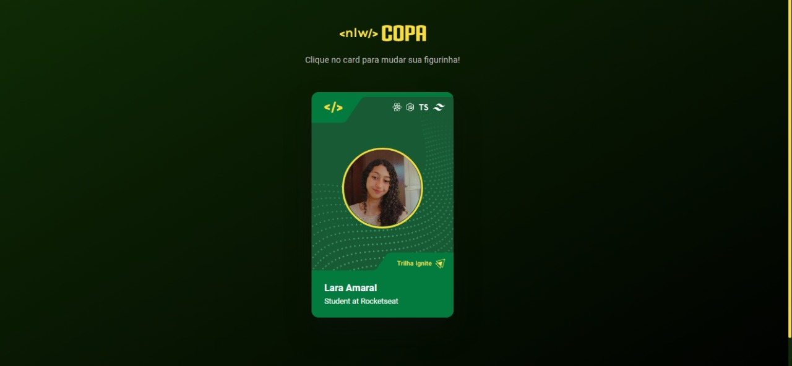

# Figurinha da Copa
Projeto com a temática da copa desenvolvido no vídeo [Crie sua figurinha da copa](https://youtu.be/sswJisbD2CY) da Rocketseat. Nele há um card onde muda a figurinha quando é clicado.

___

## Tecnologias
- HTML
- CSS
- JavaScript
___
## Detalhes JavaScript
Foi feita uma função chamada changeCard, ela serve para mudar o background do card. 
- A constante "card" serve para pegar o algo que dispara o evento
- A const "bg" tem uma lógica onde: se é Ignite (o background) ele usa o nome explorer, se não, usa o Ignite
- Acessei o estilo do card para mudar o background
